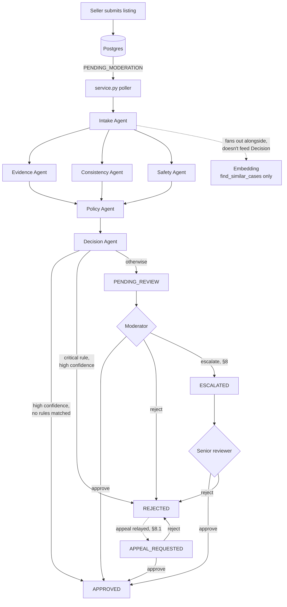
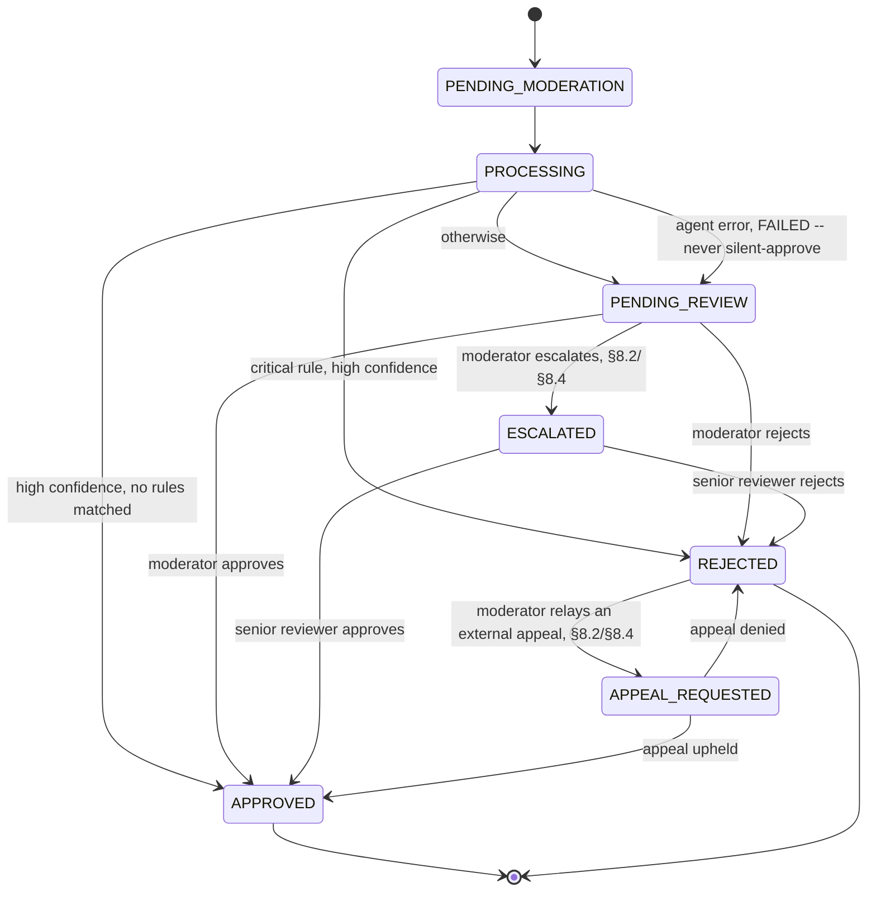

# Agentic Marketplace Moderator — Build Spec

A multi-agent moderation pipeline for marketplace listings. A seller submits a listing;
a chain of agents evaluates it and routes it to **APPROVE**, **REJECT**, or **REVIEW**
(human-in-the-loop). Moderators work the review queue entirely through a conversational
CLI — no web UI.

Stack: **Postgres** (storage), **Claude Code** (orchestration + CLI), **NVIDIA Nemotron
3.5 Content Safety** (called via its hosted API for the Safety Agent step).

---

## 1. Architecture



Intake runs first (produces the canonical document). Evidence, Consistency, Safety, and
Policy then run in parallel off that document — Consistency depends only on the canonical
document too, not on Evidence's output, so it doesn't need to wait in line behind it.
Decision Agent waits on all four. Single process, async fan-out/fan-in — no broker, no
separate API service. Escalation and appeal (§8) are moderator-only — the automated
Decision Agent never produces `ESCALATED` or `APPEAL_REQUESTED`.

---

## 2. Listing State Machine

Listings arrive in the DB with `status: "PENDING_MODERATION"` — that value is the
workflow trigger, not a status the workflow assigns.



`ESCALATED` and `APPEAL_REQUESTED` are both moderator-only -- the automated Decision
Agent (§3.6/§4) never produces either, only APPROVE/REJECT/REVIEW. Resolving an
escalated or appealed case reuses `approve_listing`/`reject_listing`/`resolve_appeal`
rather than separate terminal states for "approved via escalation" or "approved via
appeal" -- §5's append-only artifact log already distinguishes these via each
artifact's `version` field, no new status vocabulary needed. Only `REJECTED`
listings can be appealed, not `APPROVED` ones -- there's no real use case for
contesting an approval. There is no senior-reviewer role distinction in the
`moderators` table (§6) -- any active moderator can resolve an `ESCALATED` or
`APPEAL_REQUESTED` case, same as a `PENDING_REVIEW` one. Noted as a known
simplification (§8.4), not solved yet.

### 2.1 Claiming Listings (Locking Model)

The poller claims work with a single atomic transaction — no lock table, no broker:

```sql
UPDATE listings
SET status = 'PROCESSING', updated_at = now()
WHERE listing_id IN (
    SELECT listing_id FROM listings
    WHERE status = 'PENDING_MODERATION'
    ORDER BY created_at
    LIMIT :batch_size
    FOR UPDATE SKIP LOCKED
)
RETURNING *;
```

`FOR UPDATE SKIP LOCKED` means a row already locked by another in-flight transaction is
skipped, not blocked on — two poller instances (or a restarted poller racing its own
predecessor) can never claim the same listing twice. This is what makes it safe to run
more than one poller even though each individual pipeline run stays single-process
fan-out/fan-in (§1); no cross-process coordination beyond the one `UPDATE` is needed.

**Stale claims.** A worker that crashes mid-pipeline leaves its row in `PROCESSING`
indefinitely. A sweep, run on a timer (e.g. every minute), resets any row that has been
`PROCESSING` longer than a lease timeout (default 5 minutes, configurable) to
`PENDING_REVIEW` flagged `FAILED` — the same terminal-on-error path as §4, not a special
case:

```sql
UPDATE listings
SET status = 'PENDING_REVIEW', updated_at = now()
WHERE status = 'PROCESSING' AND updated_at < now() - interval '5 minutes';
```

Requires an `updated_at` column on `listings`, touched on every status transition
(added to `schema.sql`).

---

## 3. Agents

### 3.1 Intake Agent
Reads a listing row where `status = "PENDING_MODERATION"` and maps it to the canonical
document every other agent consumes. Does not need to introspect the schema — this is
the actual listing shape:

**In (DB row)**
```json
{
  "listingId": "LST-100234",
  "seller": { "sellerId": "SUP-9281", "companyName": "Global Trade Ltd",
              "country": "United Kingdom", "verified": true, "rating": 4.8,
              "previousViolations": 0 },
  "title": "Apple iPhone 16 Pro Max 256GB",
  "description": "Brand new, factory sealed with international warranty.",
  "category": { "id": "electronics.mobile", "name": "Mobile Phones" },
  "price": { "amount": 899.99, "currency": "GBP" },
  "quantity": 100,
  "condition": "new",
  "brand": "Apple",
  "model": "iPhone 16 Pro Max",
  "sku": "APL-IP16PM-256",
  "images": [ { "id": "img-1", "url": "s3://listings/img1.jpg" },
              { "id": "img-2", "url": "s3://listings/img2.jpg" } ],
  "attributes": { "colour": "Black", "storage": "256GB", "origin": "China" },
  "shipping": { "location": "London", "leadTimeDays": 5 },
  "createdAt": "2026-07-24T20:45:31Z",
  "status": "PENDING_MODERATION"
}
```

**Out (canonical)**
```json
{
  "listingId": "LST-100234",
  "title": "Apple iPhone 16 Pro Max 256GB",
  "description": "Brand new, factory sealed with international warranty.",
  "images": ["s3://listings/img1.jpg", "s3://listings/img2.jpg"],
  "sellerId": "SUP-9281",
  "sellerVerified": true,
  "sellerPreviousViolations": 0,
  "categoryId": "electronics.mobile",
  "declaredBrand": "Apple",
  "condition": "new"
}
```
Images are `s3://` URIs, not HTTP URLs — Evidence and Consistency Agents fetch them via
`images.fetch_image_bytes` (a shared `boto3` helper), not a plain web fetch. Works
against real AWS S3 or any S3-compatible store (self-hosted via MinIO for local
dev/test — see `docs/decisions/0006-s3-storage-self-hosted-minio.md`).

**`images[].url` is seller-controlled with no schema-level restriction on
scheme/path/bucket.** Confirmed live (`docs/decisions/0033`) that before a fix,
`fetch_image_bytes` would read *any* local file a `file://` URL pointed at — no
allowlisting — with two automatic trigger paths: pipeline processing (uploading the
file's bytes to NVIDIA's hosted API as "image" content) and `/inspect --queue`
(serving it to a moderator's browser). `fetch_image_bytes` now restricts `file://` to
`LOCAL_IMAGE_ROOTS` (env-configurable, default: this project's own `images/`
directory) and offers an opt-in `S3_ALLOWED_BUCKETS` allowlist for `s3://`.

`declaredBrand` is carried through specifically so the Evidence Agent can cross-check it
against whatever brand it detects from the images/OCR (see §3.2) — that mismatch is what
drives the "counterfeit branding" case already used as the CLI example in §6.

`sellerPreviousViolations` is carried through as a plain field, not a separate agent —
the Decision Agent factors seller history directly into confidence/severity (§3.6)
without needing a dedicated "risk agent" to compute it.

### 3.2 Evidence Agent
Facts only, no judgment. OCR, image understanding, brand/object detection, and
document-level extraction (certificate numbers, serial numbers, expiry dates, country of
origin where visible on packaging/labels) via vision-language model
`meta/llama-3.2-11b-vision-instruct` (originally `nvidia/nemotron-nano-12b-v2-vl`,
NVIDIA end-of-lifed that model 2026-08-26 — `docs/decisions/0025`), one call per image,
results merged across all of a listing's images. Compares detected brand(s) against the canonical document's
`declaredBrand` and flags a mismatch if they disagree — that's the input the Policy
Agent needs to catch counterfeit listings. **No brand detected on any image at all also
counts as a mismatch** when a brand is declared — an undeclared logo and a genuinely
absent one are both "the packaging doesn't corroborate the claim," which is exactly the
counterfeit-branding signal C001 needs; it is not required that a *different* brand be
detected. Exception: `declaredBrand` values of `generic`, `unbranded`, `no brand`,
`none`, or `n/a` (case-insensitive) aren't a brand claim at all, so they never trigger a
mismatch — otherwise every legitimately unbranded/commodity listing would falsely match
C001.

**Fails open per-image on a hung/unresponsive backend (`docs/decisions/0029`):**
extraction for each image independently uses its own timeout
(`EVIDENCE_EXTRACTION_TIMEOUT`, default 20s, down from an old 60s) and retries once on
a malformed (non-JSON) response before skipping that image (added to `imagesSkipped`)
rather than crashing the whole listing — one image's extraction failing doesn't affect
the others. If *every* attempted image was skipped, `brandMismatch` stays `false`
regardless of `declaredBrand`, deliberately different from the zero-images-at-all case
above: "couldn't check" (an infrastructure failure) must not manufacture the same
signal as "checked and found nothing" (a real content signal). Partial failure (some
images succeed, some skip) still uses whatever brands the successful images found.

Written as an `EvidenceAgent` artifact per §5 (this is its `payload`):

**Out**
```json
{ "objects": ["smartphone", "retail box"], "brandsDetected": ["Apple"],
  "ocr": ["Apple", "iPhone", "256GB"], "brandMismatch": false,
  "certificateNumbers": [], "serialNumbers": [], "expiryDate": null,
  "countryOfOrigin": "China", "imagesSkipped": [] }
```

Implemented in `agents/evidence_agent.py`. Images are fetched via the shared
`images.fetch_image_bytes` helper — `file://` for local dev/demo, `s3://` (the
production scheme, §3.1) via `boto3`.

### 3.3 Consistency Agent
Cross-checks fields that should agree with each other but are supplied independently:
title↔description, description↔images, images↔declared brand, category↔detected
objects. Doesn't judge policy — just surfaces disagreement for the Decision Agent to
weigh. Does its own lightweight image understanding for the three image-based checks
rather than reusing Evidence Agent's output — required by §1: Consistency depends only
on the canonical document, not on Evidence's output.

Each check is one true/false model call (text model `mistralai/mistral-nemotron` for
title↔description, vision model `meta/llama-3.2-11b-vision-instruct` — see §3.2's note
on the vision model swap, `docs/decisions/0025` — for the three image-based checks).
**Prompt injection defense (`docs/decisions/0033`):** every field interpolated into a
check's prompt (title, description, declared brand, category) is wrapped via
`prompt_safety.wrap_untrusted` — delimiters plus an explicit "treat as data, not
instructions" framing. Confirmed via a real adversarial test this is defense-in-depth,
not a guarantee: injected text in a description still fooled the text-check model on
some trials even with wrapping in place, though at sharply reduced confidence (99.66%
→ 29-70% across repeated trials) — see `agents/policy_agent.py`'s independent INJ001
detector (§3.5) for the complementary, non-LLM containment layer. With more than one
image, a check is `consistent` if *any* image
confirms it. `inconsistencyScore` is not a separate judgment call — it's the mean, over
all checks, of the probability mass the model itself placed on the "inconsistent"
answer (1 − confidence when the verdict was consistent, confidence itself when it
wasn't), so a run of confidently-consistent checks produces a score near 0 without
that number being invented.

Note: `description_vs_images` is measurably noisier than the other three checks —
tested (not assumed) whether real product photography would fix this, per
`docs/decisions/0013`. Result was mixed, not a clean fix:

- It did resolve a related, more serious problem: with the demo's original synthetic
  images, Evidence Agent's brand detection was reliable, but real photos exposed a
  false-positive risk (misreading incidental text near a logo as a fabricated brand)
  that's now fixed by picking unambiguous photos and verified reliable (10/10 real
  calls).
- It did **not** reduce `description_vs_images` noise for the `clean` listing —
  mean `inconsistencyScore` across 6 real-call samples went from 0.171 (old synthetic
  placeholder) to ~0.395 (real photo), i.e. noisier, not less. The synthetic
  placeholder's OCR-readable text let the vision model "match" by literally reading
  text back, not by genuine visual reasoning; a real photo that shows only the bare
  device (no screen, no box, nothing distinguishing "Pro Max 256GB" from any other
  iPhone 16) is honestly harder to visually confirm against a specific title/spec
  claim, not easier. Remains open — a photo with more distinguishing visual detail
  (screen on, retail packaging with model/storage text) is the next thing to try, not
  assumed to be the fix without testing it too.

**Fails open per-check on a hung/unresponsive backend (`docs/decisions/0028`):**
`mistral-nemotron` has been confirmed to accept a connection and request but never
respond at all, no error, no timeout of its own (same finding as `0022`, which fixed
Safety Agent's analogous case). Each of the four checks above uses its own short
timeout (`CONSISTENCY_CHECK_TIMEOUT`, default 10s) rather than the old shared 30s, and
independently skips (lands in `checksSkipped`, not `checks`) on a timeout, connection
failure, or two malformed responses in a row — the other checks are unaffected. A
skipped check contributes nothing to `inconsistencyScore` (excluded from the mean
entirely, not counted as consistent or inconsistent); if every check was skipped,
`inconsistencyScore` defaults to `0.0` rather than raising on an empty mean. Known,
stated trade-off: a total outage makes this agent read as "fully consistent" to
Decision Agent's fusion math (§4), even though `checksSkipped` records what actually
happened — Decision Agent doesn't currently look at `checksSkipped`, only the score.

**Heuristic backstop for `title_vs_description` when skipped (`docs/decisions/0030`):**
found live during a moderator walkthrough — a title/description swap
("Apple iPhone" title, "Samsung Galaxy" description) went completely uncaught because
the exact check meant to catch it was skipped mid-outage. A narrow, manually-maintained
keyword heuristic (`_heuristic_title_vs_description_contradiction`) runs **only** when
the real model check returned skipped, never overriding an actual model verdict. It
recognizes an explicit named competing brand (e.g. "Apple" vs "Samsung"), with
disqualifying patterns for comparison/compatibility/barter phrasing ("better than",
"compatible with", "for your") that would otherwise false-positive on ordinary
marketplace language. A heuristic hit is recorded at `HEURISTIC_BACKSTOP_CONFIDENCE`
(default 0.7 — deliberately below typical real model confidence) with
`"method": "heuristic-backstop"` on the `checks` entry (vs. `"method": "model"` for a
real call); a heuristic miss still counts as skipped, not as a passing check — it can't
rule out non-brand-name contradictions, so absence of a hit is not evidence of
consistency. Not a general contradiction detector, and not meant to become one.

Written as a `ConsistencyAgent` artifact per §5.

**Out**
```json
{ "checks": [
    { "pair": "title_vs_description", "consistent": true, "method": "model" },
    { "pair": "description_vs_images", "consistent": true, "method": "model" },
    { "pair": "images_vs_declaredBrand", "consistent": true, "method": "model" },
    { "pair": "category_vs_detectedObjects", "consistent": true, "method": "model" }
  ],
  "checksSkipped": [],
  "inconsistencyScore": 0.02 }
```

Implemented in `agents/consistency_agent.py`.

### 3.4 Safety Agent
Content-safety classification, model `nvidia/llama-3.1-nemotron-safety-guard-8b-v3`
(not `nemotron-3.5-content-safety` — that model only returns a binary safe/unsafe
verdict with no category, and Policy Agent needs a category to pick a rule). Classifies
`title` + `description` text; images/OCR-based safety checks are Evidence Agent's job
(§3.2), not this agent's. Written as a `SafetyAgent` artifact per §5. Both the
classification call and the prize-scam second-opinion check (below) wrap the raw
listing text via `prompt_safety.wrap_untrusted` (`docs/decisions/0033`) — this
purpose-built classifier resisted a direct injection attempt in real-call testing
(confirmed both before and after adding the wrapping), noted as a real, model-specific
data point, not a defense to rely on alone given §3.3's contrary result on a
general-purpose model.

`confidence` is the model's own log-probability for the safe/unsafe token it emitted
(`logprobs: true` on the chat completion), not a separately requested score. `violations`
is the model's raw `Safety Categories` string, split on `,`.

A verdict below `SAFE_RETRY_CONFIDENCE_THRESHOLD` (default 0.5) gets one retry
(`docs/decisions/0019`, extended by `0024`) — confirmed via real calls that the model
occasionally emits a well-formed but wrong verdict at near-zero confidence, in either
direction: `safe` on genuinely fraudulent text (0019), or `unsafe` with spurious
categories on genuinely clean text (0024, found via `docs/decisions/0023`'s eBay
false-positive eval — a real clothing listing was flagged `Criminal
Planning/Confessions` + `PII/Privacy` at confidence 0.0086). The two directions
resolve asymmetrically on purpose: a low-confidence `safe` prefers the retry if it
comes back unsafe at all, or more confidently safe (biases toward catching missed
fraud, never invents a violation from a safe-then-safe pair); a low-confidence
`unsafe` has no such bias — whichever of the two calls was more confident wins (the
"prefer unsafe" bias would make this retry pointless, since the first call is already
unsafe). Configurable via the `SAFETY_SAFE_RETRY_THRESHOLD` env var, same pattern as
`docs/decisions/0008`.
**Known limitation, not fixed by either retry direction:** some fraud patterns
(confirmed: lottery/advance-fee "you won a prize, pay a fee to claim it" scams) are a
systematic model blind spot, not a sampling-variance one — the model confidently and
consistently calls them safe regardless of retries, phrasing, or language. See
`docs/decisions/0019` and the targeted check below (`0020`).

A listing still `safe` after the retry above gets one more check: a targeted question
to a general text model (`mistralai/mistral-nemotron`, same model and "ask one specific
true/false question" pattern already used by Consistency Agent) asking whether the
listing describes receiving something of value contingent on the recipient first
sending money — the prize/advance-fee scam pattern the primary classifier can't see
(`docs/decisions/0020`). Only runs when the primary classifier already said safe, to
avoid the extra call on listings already flagged unsafe by something else. A `true`
result adds a synthetic `Prize/Advance-Fee Scam` category — not from the safety-guard
model's own taxonomy — mapped to F001 like the others. Confirmed via real calls: 13/15
(~87%) recall across three real-call test variants repeated 5x each, up from 0/9 before
this check existed — a large improvement, not a complete fix; still probabilistic, not
guaranteed on every call.

**Fails open on a hung/unresponsive backend (`docs/decisions/0022`):** real-call
testing found `mistral-nemotron`'s endpoint intermittently accepts the connection and
request but never sends a response — no error, no timeout of its own. This check uses
its own short timeout (`PRIZE_SCAM_CHECK_TIMEOUT`, default 10s — real-call latency is
normally under 2s) rather than the primary classifier's 30s, and treats a timeout,
connection failure, or two malformed responses in a row as "skip" rather than raising:
the primary classifier's verdict stands unchanged, and a `logger.warning` records the
skip. During an outage, this specific check's recall reverts to the pre-0020 blind
spot for its duration — accepted as one signal among several (Policy Agent's other
F001 triggers, human review) rather than the sole fraud defense.

Full taxonomy confirmed empirically (`docs/decisions/0012`) — real calls to the real
model with one prompt per suspected category, not a scraped model-card page.
Categories observed: `Guns and Illegal Weapons`, `Controlled/Regulated Substances`,
`Criminal Planning/Confessions`, `Illegal Activity`, `Fraud/Deception`, `Sexual`,
`Sexual (minor)`, `PII/Privacy`, `Hate/Identity Hate`, `Immoral/Unethical`,
`Suicide and Self Harm`, `Violence`, `Harassment`, `Profanity`,
`Copyright/Trademark/Plagiarism`, `Political/Misinformation/Conspiracy`,
`Needs Caution`. Only the subset that's clearly marketplace-listing-policy relevant
maps to a Policy Agent rule (§3.5) — most of the rest are general chat-safety
categories (violence, hate speech, profanity, misinformation) not obviously
actionable on a product listing; revisit if this pipeline's scope ever grows beyond
listing text. `Criminal Planning/Confessions` and `Illegal Activity` are exceptions —
not general chat-safety noise but a reliable fraud signal in Arabic-language listing
text specifically (`docs/decisions/0018`), mapped to F001. `Prize/Advance-Fee Scam`
(`docs/decisions/0020`) is not part of this taxonomy at all — it's synthetic, emitted
by Safety Agent's own second-opinion check, not the safety-guard classifier.
`explanation` is generated deterministically from the category list, not model-written
prose.

**Out**
```json
{ "violations": ["Guns and Illegal Weapons"], "confidence": 0.97,
  "explanation": "Content flagged as unsafe: Guns and Illegal Weapons." }
```

Implemented in `agents/safety_agent.py`.

### 3.5 Policy Agent
Maps evidence/safety/consistency findings to policy rules, keyed off `categoryId` (e.g.
`electronics.mobile`). Rule sets are looked up per category prefix
(`RULE_SETS_BY_CATEGORY_PREFIX` in `agents/policy_agent.py`), designed to let different
category trees (e.g. `electronics.*` vs. `finance.*`) apply different rule sets — but
today only the catch-all `"*"` entry exists, so every category currently gets the same
7 rules. No category has needed narrowing yet; add a prefix key when one does. Returns
an **array** — a listing can match more than one rule.

| Rule ID | Description | Severity | Triggered by |
|---|---|---|---|
| W001 | Weapons prohibited | Critical | Safety Agent `violations` contains `Guns and Illegal Weapons` |
| C001 | Counterfeit goods prohibited | High | Evidence Agent `brandMismatch: true`, or Safety Agent `violations` contains `Copyright/Trademark/Plagiarism` |
| C004 | Misleading product information | Medium | Consistency Agent `inconsistencyScore` above threshold |
| D001 | Illegal drugs prohibited | Critical | Safety Agent `violations` contains `Controlled/Regulated Substances` |
| F001 | Fraud or deceptive listings prohibited | High | Safety Agent `violations` contains `Fraud/Deception`, `Criminal Planning/Confessions`, `Illegal Activity`, or `Prize/Advance-Fee Scam` |
| S001 | Sexual content involving minors prohibited | Critical, **autoReject** | Safety Agent `violations` contains `Sexual (minor)` |
| INJ001 | Possible prompt injection or model manipulation attempt | High | Raw `title`/`description` matches a narrow, non-LLM keyword pattern (`docs/decisions/0033`) — deliberately not `autoReject`, forces `REVIEW` instead |

C001's two triggers are deduped to at most one match (the higher of the two
confidences) — never two separate `C001` entries in `matches` even if both signals
fire. The `Copyright/Trademark/Plagiarism` text signal was confirmed unreliable in
testing (`docs/decisions/0012`) — treat it as a secondary signal, not a substitute for
Evidence Agent's image-based `brandMismatch`. F001's four triggers dedupe the same
way — at most one `F001` match even if more than one of the four categories fires.

`Criminal Planning/Confessions` and `Illegal Activity` were originally left unmapped
(`docs/decisions/0012`) as too broad to be their own signal. `docs/decisions/0018`
revised that after real-call testing against Arabic job-scam and real-estate-scam
listing text found the opposite: the same scam intent that reliably surfaces as
`Fraud/Deception` in English often surfaces as these two categories instead in Arabic,
and neither produced false positives across a broader batch of clean/edgy-but-legal
Arabic listings. `docs/decisions/0019` (a retry on low-confidence safe verdicts) and
this mapping together substantially closed the non-determinism gap for job/real-estate
scams (confirmed 5/5 recall on repeat real calls). `Prize/Advance-Fee Scam` was added
separately (`docs/decisions/0020`) for a systematic, not stochastic, blind spot the
other three triggers never catch — see §3.4.

Each match also carries a `confidence`, attributed from whichever upstream agent's signal
triggered the rule — Policy Agent passes through that agent's number rather than
inventing its own probability:

| Rule triggered by | `confidence` source |
|---|---|
| SafetyAgent violation (W001, D001, F001, S001) | `SafetyAgent.payload.confidence` |
| EvidenceAgent `brandMismatch: true` and/or SafetyAgent `Copyright/Trademark/Plagiarism` (C001) | `max(1.0 if brandMismatch, SafetyAgent.payload.confidence if the category fired)` |
| ConsistencyAgent `inconsistencyScore` above threshold (C004) | `ConsistencyAgent.payload.inconsistencyScore` |
| Raw listing text matches an injection pattern (INJ001) | Fixed `1.0` — a deterministic keyword match either fires or doesn't, no upstream agent confidence to pass through |

Written as a `PolicyAgent` artifact per §5.

**Out**
```json
{ "matches": [
    { "rule": "C001", "severity": "High", "autoReject": false, "confidence": 1.0 }
] }
```

Deterministic — pure rule logic over the three upstream payloads, no model call.
Implemented in `agents/policy_agent.py`. `autoReject` is `true` only for S001 — the
hard-override lever reserved since the original spec (§4 step 1) for a rule that should
bypass confidence-based routing entirely; every other rule leaves it `false`.
`CONSISTENCY_THRESHOLD` (0.48) for C004 is tuned from real model-call data — 8 real
Consistency Agent runs per demo scenario showed a clean gap between the one scenario
that should trigger C004 (`inconsistent`, scores 0.505-0.712) and every scenario that
shouldn't (0.089-0.461); see `docs/decisions/0014`. Fixes C004 rule accuracy (e.g. the
`clean` scenario no longer falsely matches it) but does **not** on its own get `clean`
to auto-approve — that's gated by the separate, stricter `AUTO_APPROVE_THRESHOLD` bar
(§4), still an open question (`docs/decisions/0013`). Configurable via the
`CONSISTENCY_THRESHOLD` env var (read once at process start) or a per-call override on
`run_policy_agent` — see `docs/decisions/0008-env-var-thresholds.md`.

### 3.6 Decision Agent
Aggregates `PolicyAgent.matches` into a single decision and confidence using the fusion
algorithm in §4 — it combines the confidences Policy Agent already attributed per match,
it does not re-derive them from raw agent outputs. Seller history
(`sellerPreviousViolations`) shifts confidence toward REVIEW/REJECT for otherwise-
borderline cases (§4) rather than triggering its own rule. Written as a `DecisionAgent`
artifact per §5 — this is that artifact's `payload`:

**Out**
```json
{ "decision": "REVIEW", "confidence": 0.73, "policyRules": ["C001"],
  "explanation": "Brand detected but authenticity cannot be verified from supplied images." }
```

Deterministic — pure fusion logic per §4, no model call. `explanation` is generated
from the matched rules' own descriptions (or the residual inconsistency score when
none matched) plus the seller-history adjustment if one applied, not model-written
prose — same pattern as Safety and Consistency Agents. Implemented in
`agents/decision_agent.py`.

---

## 4. Decision Fusion & Confidence Routing

Deterministic, in three steps — no learned weighting, no free-form LLM judgment call on
the final number:

**Step 1 — aggregate confidence.**
- `matches` non-empty → `confidence = max(match.confidence for match in matches)`.
- `matches` empty → `confidence = 1 - ConsistencyAgent.payload.inconsistencyScore` — the
  only residual risk signal available when no policy rule fired.

**Step 2 — seller history adjustment.** If `sellerPreviousViolations > 0`, compute
`adjustment = min(0.05 * sellerPreviousViolations, 0.20)`:
- Would this route to APPROVE (see Step 3) → subtract `adjustment` from `confidence`
  first (repeat-violation sellers lose the benefit of the doubt, more of their
  borderline listings fall through to REVIEW).
- Would this route to REJECT → add `adjustment` to `confidence` first (repeat-violation
  sellers need less certainty to confirm a reject).
- This is the only effect seller history has — it never manufactures a policy match of
  its own (§3.1).

**Step 3 — routing**, using the adjusted `confidence`:

| Order | Condition | Result |
|---|---|---|
| 1 | any match has `autoReject: true` | Reject (hard override, ignores confidence) |
| 2 | any match has `severity: "Critical"` and `confidence ≥ 0.95` | Reject |
| 3 | `matches` empty and `confidence ≥ 0.90` | Approve |
| 4 | otherwise | Review |

Thresholds (`0.95`, `0.90`, the `0.20` adjustment cap) are configurable, not hard-coded
— via `CRITICAL_REJECT_THRESHOLD` / `AUTO_APPROVE_THRESHOLD` /
`SELLER_HISTORY_ADJUSTMENT_PER_VIOLATION` / `SELLER_HISTORY_ADJUSTMENT_CAP` env vars
(read once at process start, same pattern as `service.py`'s config) or per-call
overrides on `run_decision_agent` — see `docs/decisions/0008-env-var-thresholds.md`.
Critical-severity matches never auto-approve regardless of score — they resolve to
REJECT or REVIEW only.

If any agent errors or times out, the listing goes to `PENDING_REVIEW` (flagged `FAILED`)
rather than defaulting to approve.

---

## 5. Storage: Append-Only Artifact Log

The raw listing row is never mutated. Each agent run writes one immutable artifact
instead — this is what makes single-stage reruns (`rerun_analysis`) safe and gives a full
audit trail without a flat "decision + evidence" blob that different agents all write
into.

```json
{
  "listingId": "LST-100234",
  "agent": "SafetyAgent",
  "version": "nemotron-3.5",
  "producedAt": "2026-07-24T20:45:55Z",
  "payload": { "violations": ["Weapons"], "confidence": 0.97, "explanation": "string" }
}
```

One row per agent run, `agent` + `version` identifying what produced it. A rerun
(e.g. Safety Agent on a newer model) appends a new artifact rather than overwriting the
old one — prior runs stay queryable for comparison.

**Decision artifacts** are the same shape, with the Decision Agent's output as payload,
and reference the specific upstream artifacts they were computed from:

```json
{
  "listingId": "LST-100234",
  "agent": "DecisionAgent",
  "version": "string",
  "producedAt": "2026-07-24T20:46:02Z",
  "payload": {
    "decision": "REVIEW",
    "confidence": 0.73,
    "policyRules": ["C001"],
    "explanation": "Brand detected but authenticity cannot be verified from supplied images.",
    "moderator": "string | null"
  },
  "basedOn": ["EvidenceAgent@<producedAt>", "ConsistencyAgent@<producedAt>",
              "SafetyAgent@<producedAt>", "PolicyAgent@<producedAt>"]
}
```

`policyRules` stays the single source of truth for what was violated — no separate free-
text `violations` list duplicating it; any human-readable line is derived from the rule's
own description plus `explanation` for the case-specific reasoning.

The **latest** `DecisionAgent` artifact per listing is the listing's current decision.
Moderator overrides append a new `DecisionAgent` artifact with `moderator` set, rather
than editing the automated one.

`show case` (§6) assembles a view from: the raw listing row + all artifacts for that
`listingId`, ordered by `producedAt`.

---

## 6. Moderator CLI

Conversational, tool-driven, no direct DB access. Implemented as a plain Python tool
layer in `cli/tools.py` (backed by `db.py` and `pipeline.py`, orchestration in
`pipeline.py`, Intake mapping in `intake.py`) — there is no separate chat loop; a
moderator drives it by talking to Claude Code, which calls these functions directly.
Verified end-to-end against a real Postgres instance: seeded via
`generate_synthetic_data.py`, processed with `pipeline.poll_and_process()`, then every
tool below exercised against it (`list_pending`, `get_listing`, `explain_case`,
`show_images`, `search_policy`, `find_similar_cases`, `approve_listing`,
`reject_listing`, `rerun_analysis`, `escalate_case`, `request_appeal`,
`resolve_appeal`, `list_seller_cases`, `suspend_seller`, `reinstate_seller`) —
moderator overrides confirmed to append a new `DecisionAgent` artifact rather than
overwrite the automated one (§5).

**Example**
```
> show next case

Listing 98342 — Rolex Watch
Status: Pending Review · Confidence: 74%
Issues: Counterfeit branding, Missing serial number
Recommendation: Manual verification required.

> explain case 98342

Evidence Agent
✓ Apple logo detected
✓ OCR found "iPhone 16"

Consistency Agent
⚠ Description mentions a different model than the title

Safety Agent
✓ No prohibited content

Policy Agent
Rule C004: Misleading product information

Decision Agent
REVIEW (Confidence: 0.74)

> approve
```
`explain case` reads straight off the artifact log (§5) — one section per agent artifact
for that listing, in order — rather than a separate reasoning trace to maintain.

**Example — escalation and appeal (§8)**
```
> this one looks like it needs a second opinion, escalate it

escalate_case(98342, "Ambiguous branding, want a senior reviewer's read.")
Listing 98342 → ESCALATED

> [senior reviewer, later] reject it, counterfeit confirmed

reject_listing(98342, "senior-mod", "Counterfeit confirmed on closer inspection.")
Listing 98342 → REJECTED · seller violation_count: 4 → 5

> the seller is disputing this one, they say they have proof of authenticity

request_appeal(98342, "Seller provided proof of authenticity.")
Listing 98342 → APPEAL_REQUESTED

> resolve it, approve the appeal, proof checks out

resolve_appeal(98342, "APPROVE", "Proof accepted, overturning rejection.")
Listing 98342 → APPROVED · seller violation_count unchanged (not double-counted)

> this seller has had one violation too many, show me everything from them

list_seller_cases("SUP-1234")
[5 listings: 3 approved, 1 rejected, 1 approved-on-appeal]

> suspend their account

suspend_seller("SUP-1234", "Repeated policy violations across multiple listings.")
Seller SUP-1234 → SUSPENDED
```
Escalation and appeals reuse `APPROVED`/`REJECTED` as the actual outcome status
rather than separate terminal states (§8.2) — the artifact log's `version` field
(`"moderator-appeal-resolution"`) is what distinguishes an appeal outcome from a
plain decision, not a different status value. There is no seller-facing surface in
this system (§8.1) — `request_appeal` relays an appeal that reached a moderator
through some other channel, it isn't triggered by the seller directly.

**Tools**
| Tool | In | Out |
|---|---|---|
| `list_pending()` | `{ limit?, category? }` | `Listing[]` |
| `get_listing(listingId)` | `{ listingId }` | full document + agent outputs |
| `explain_case(listingId)` | `{ listingId }` | all artifacts for the listing, per-agent |
| `approve_listing(listingId, moderatorId?, note?)` | — | updated status |
| `reject_listing(listingId, moderatorId?, reason)` | — | updated status |
| `escalate_case(listingId, reason, moderatorId?)` | — | updated status (§8.2/§8.4, PENDING_REVIEW only) |
| `request_appeal(listingId, reason, moderatorId?)` | — | updated status (§8.2/§8.4, REJECTED only) |
| `resolve_appeal(listingId, decision, reason, moderatorId?)` | `{ decision: APPROVE\|REJECT }` | updated status (§8.2/§8.4, APPEAL_REQUESTED only) |
| `list_seller_cases(sellerId)` | — | `Listing[]` (§8.4) |
| `suspend_seller(sellerId, reason, moderatorId?)` | — | updated seller status (§8.4, ACTIVE only) |
| `reinstate_seller(sellerId, reason, moderatorId?)` | — | updated seller status (§8.4, SUSPENDED only) |
| `search_policy(query)` | `{ query }` | matching rule(s) |
| `find_similar_cases(listingId, k?)` | — | `Case[]` |
| `show_images(listingId)` | — | image URLs |
| `rerun_analysis(listingId, agent?)` | — | new agent output |
| `record_decision(listingId, decision, reason)` | — | audit entry (§5 schema) |
| `whoami(moderatorId?)` | — | moderator's own registry entry |
| `get_stats(since?)` | `{ since?: ISO timestamp }` | accuracy/performance report (§6's stats note below, docs/decisions/0027) |

Planned additions (escalation/appeals/seller accounts, not yet implemented) are
tracked separately in §8.4 rather than this table, since they depend on state-machine
and schema changes (§8.2/§8.3) that don't exist yet.

**Inspecting a case's images.** `show_images` returns raw `s3://`/`file://` URLs, not
viewable pixels. `.claude/skills/inspect/` (invoked as `/inspect
<listingId>` or proactively when a moderator asks to see a case; renamed from
`inspect-listing` for brevity, `docs/decisions/0031`) runs
`scripts/inspect_listing.py`, which prints the listing's text + latest agent artifacts
and fetches each image to a local temp file, then shows images one of two ways, paced
by the moderator: by default Claude Code reads each path with its own Read tool,
rendering inline in the conversation; with `--serve`, the script instead starts a
throwaway HTTP server on `127.0.0.1` and prints a browser URL per image (`--stop-server`
tears it down) -- a real pop-up window/tab, reachable from a Windows browser under WSL2
via automatic `localhostForwarding`, no interop or display server required either way.
Not an external OS image viewer directly -- see
`docs/decisions/0011-inspect-listing-inline-read-not-external-viewer.md` for why (WSL
interop disabled, no display server on the dev host) and how both fallbacks were
verified against a real Windows browser.

For surveying multiple listings rather than deep-diving one, `--queue` (optionally
`--status <status>[,<status>...]`) prints a single markdown table -- listing ID,
title, status, decision, confidence, policy rules, and an image link per row --
backed by one persistent image server covering every listing's images at once,
instead of restarting a server per listing. Added after real moderator feedback that
the per-listing flow was too much friction with no decision/confidence visibility —
see `docs/decisions/0015-inspect-listing-queue-table.md`.

**Moderator identity.** `moderatorId` is checked against a `moderators` table
(`moderator_id`, `name`, `active`) — authorization, not authentication: no passwords,
no tokens, no login flow, because the CLI is a tool layer driven by a trusted operator
through Claude Code (§2 note in §6's intro), not a network-exposed service with
untrusted callers. `approve_listing`/`reject_listing`/`record_decision` reject an
unknown or inactive `moderatorId` outright. When omitted, `moderatorId` defaults to the
`MODERATOR_ID` environment variable (same convention as git's `user.name`) — still
validated against the table, an unset/unknown/inactive default is still rejected, just
without needing to pass it on every call. `whoami()` returns the resolved moderator's
own registry row, letting a moderator confirm their identity/active status before
acting. See `docs/decisions/0009-moderator-auth-registry.md`.

**Accuracy/performance stats.** `get_stats(since?)` (`db.get_stats`,
`scripts/pipeline_stats.py` for a markdown report) aggregates the artifact log into:
listing volume by status, automated decision distribution + avg confidence, a
moderator override rate (automated APPROVE/REJECT vs. a later differing moderator
verdict on the same listing -- `REVIEW`-routed outcomes are reported separately, not
folded in, since `REVIEW` isn't a verdict to disagree with), avg Safety Agent
confidence and Consistency Agent inconsistency score, avg end-to-end pipeline
latency, pipeline failures grouped by error, and policy rule hit counts. No new
schema -- everything derives from fields `DecisionAgent` artifacts already carry
(`version = 'fusion-v1'` for automated, `payload.moderator` for human-issued).
**Measures consistency between the pipeline and moderators, not correctness against
ground truth** -- there's no labeled outcome data flowing into this system, so this
is the closest available accuracy proxy, not a precision/recall number; see
`docs/decisions/0027` for the full reasoning and `docs/decisions/0021`/`0023` for the
real-call eval harnesses that test against corpora with actually-known outcomes
instead.

`approve_listing`/`reject_listing` are thin wrappers over `record_decision` — all three
append a new `DecisionAgent` artifact and move the listing to the matching terminal
status; the two convenience wrappers just fix `decision` to `APPROVE`/`REJECT` and set
`moderator` from `moderatorId`.

**`find_similar_cases`** ranks by real semantic similarity: a text embedding
(title + description, model `nvidia/nemotron-3-embed-1b` — originally
`nvidia/llama-nemotron-embed-1b-v2`, NVIDIA removed that model from its catalog,
`docs/decisions/0025`/`0026` — `embeddings.py`) is
computed for each listing during `pipeline.run_fusion` and stored in Postgres via
`pgvector` (`listing_embeddings` table, `embedding halfvec(2048)` with an HNSW index)
via a scalar-subquery lookup of the target embedding, chosen because a self-join form
was confirmed via real `EXPLAIN` to never use the index at all (`docs/decisions/0016`
— also documents the half-precision trade-off). Replaces the category+rule-overlap
heuristic this project shipped first (`docs/decisions/0005`, superseded by
`docs/decisions/0010`). A listing that hasn't been through the pipeline yet has no
embedding and `find_similar_cases` raises rather than silently returning nothing.

---

## 7. End-to-End Flow

1. A listing exists in Postgres with `status: "PENDING_MODERATION"`.
2. Workflow picks it up and triggers in-process -- concretely, `service.py`'s poller
   loop, calling `pipeline.poll_and_process()` on an interval (default 5s) and
   `db.sweep_stale_processing()` on a separate interval (default 60s) for stale
   `PROCESSING` claims (§2.1). Run it with `python3 service.py`; `POLL_INTERVAL_SECONDS`
   / `SWEEP_INTERVAL_SECONDS` / `SWEEP_TIMEOUT_MINUTES` / `POLL_BATCH_SIZE` configure it.
   Stops cleanly on SIGINT/SIGTERM after finishing the in-flight cycle.
3. Intake maps the row to the canonical document (§3.1).
4. Evidence, Consistency, Safety, Policy run in parallel.
5. Decision Agent applies thresholds → APPROVE / REJECT / REVIEW.
6. Decision + audit record persisted.
7. If REVIEW → listing enters the CLI queue.
8. Moderator reviews and calls `record_decision()` to close it out.

---

## 8. Escalation, Appeals, and Seller Accounts

**Status: fully implemented.** Captured as scoping ahead of implementation
(`docs/decisions/0017`) so the intended direction was documented before it was built,
not reverse-engineered from a diff later. Built incrementally, one dependency-ordered
piece per PR: §8.3's `sellers` table/violation counter, §8.2's `ESCALATED`
state/`escalate_case` tool, §8.2's appeal flow (`APPEAL_REQUESTED`,
`request_appeal`/`resolve_appeal`), and §8.4's account-action tools
(`list_seller_cases`, `suspend_seller`, `reinstate_seller`) are all now implemented.

### 8.1 Why this is split from the rest of the spec

This project doesn't know whether or how it will eventually integrate with a real
marketplace's existing seller/account backend. That backend, if one exists, almost
certainly already owns seller identity and enforcement state. Building an opinionated
`sellers` table now and assuming it's the source of truth risks a full rewrite once
the real integration contract is known. The plan instead:

- **Build now, portable regardless of backend**: escalation-tiering rules, the appeal
  state machine, the audit-trail shape (this project's existing append-only artifact
  log, §5, already generalizes to appeal records without modification).
- **Explicit placeholder, not a foundation**: any `sellers` table this project adds
  is a stand-in, not assumed to be the real source of truth -- same scoping pattern as
  `docs/decisions/0009`'s moderator-auth registry. Integrating a real backend later
  means writing a sync/adapter layer and migrating this placeholder, not rewriting the
  escalation/appeal logic itself.

### 8.2 Listing state machine extension -- implemented

Extends §2's state machine -- terminal states gain defined transitions back out
rather than staying permanently terminal:

```
PENDING_REVIEW →
    ESCALATED (senior-review tier, for high-stakes/repeat-offender cases)
        → APPROVED | REJECTED (by senior reviewer)

REJECTED →
    APPEAL_REQUESTED (moderator-invoked, relaying an appeal that reached a human
                       through some other channel -- this system has no seller-
                       facing surface at all, see §8.1)
        → APPROVED (appeal upheld -- overturns the rejection)
        → REJECTED (appeal denied -- original rejection stands)
```

`ESCALATED` addresses the gap between today's binary REVIEW/REJECT split and the
industry-standard tiered pattern (auto → confidence-routed human → senior human
review, per `docs/decisions/0017`). Appeal handling reuses `APPROVED`/`REJECTED` as
the actual outcome status rather than separate `APPEAL_APPROVED`/`APPEAL_DENIED`
terminal states -- nothing needs a listing in any status but those two to determine
liveness, and §5's artifact log already distinguishes an appeal resolution via its
`version` field (`"moderator-appeal-resolution"`), without a new status vocabulary.
Only `REJECTED` can be appealed, not `APPROVED` -- no real use case for contesting an
approval. Both narrowed from the original scoping sketch, confirmed with the human
before implementing (`docs/decisions/0017`).

### 8.3 Seller-account model (placeholder, see 8.1) -- table + counter implemented

A `sellers` table, keyed loosely to the existing embedded `seller.sellerId` JSONB
field on `listings` (§3.1) rather than replacing it outright: `seller_id`, `status`
(`ACTIVE` / `SUSPENDED` / `TERMINATED`, all listings created `ACTIVE` -- no code path
changes it yet, §8.4 below), `violation_count` (a live counter -- unlike
`sellerPreviousViolations`, which stays a static snapshot copied onto each listing at
submission time). Implemented in `schema.sql`/`db.py`:

- `db.upsert_seller_if_missing(seller_id, initial_violation_count)` -- called from
  `pipeline.process_listing` for every listing processed, seeded from that listing's
  `seller.previousViolations`. A no-op if the seller already has a row, so it never
  resets `violation_count` on a repeat listing from the same seller.
- `db.increment_seller_violations(seller_id)` -- called on REJECT, both the automated
  path (`pipeline.process_listing`) and a moderator's override
  (`cli.tools.record_decision`). Verified against a real Postgres instance: an
  automated W001 auto-reject incremented a fresh seller's count 0 → 1; a moderator
  `reject_listing` call on a different listing did the same; an `approve_listing`
  call left the count untouched.
- **Not yet done**: Decision Agent's confidence fusion (§4) still reads only the
  static `sellerPreviousViolations` snapshot, not this live counter -- deliberately
  deferred to a separate change (§8.1's why: this PR is additive-only, doesn't touch
  existing decision-making behavior). Account-level progressive status changes
  (warning → suppression → suspension → termination) and the escalation/appeal tools
  in §8.4 are not yet implemented either.

### 8.4 CLI tools -- all implemented

Extends §6's tool table:

| Tool | Purpose | Status |
|---|---|---|
| `escalate_case(listingId, reason, moderatorId?)` | Moves a `PENDING_REVIEW` case to `ESCALATED` for senior-reviewer attention | **Implemented** -- also in §6 |
| `request_appeal(listingId, reason, moderatorId?)` | Moves a `REJECTED` listing to `APPEAL_REQUESTED` | **Implemented** -- also in §6 |
| `resolve_appeal(listingId, decision, reason, moderatorId?)` | Closes an appeal -- `APPROVE` overturns, `REJECT` upholds (no double-counted violation on uphold) | **Implemented** -- also in §6 |
| `list_seller_cases(sellerId)` | Every listing tied to one seller | **Implemented** -- also in §6 |
| `suspend_seller(sellerId, reason, moderatorId?)` | Moves a seller from `ACTIVE` to `SUSPENDED`, against the placeholder `sellers` table (§8.3) | **Implemented** -- also in §6 |
| `reinstate_seller(sellerId, reason, moderatorId?)` | Moves a seller from `SUSPENDED` back to `ACTIVE` | **Implemented** -- also in §6 |

Resolving an `ESCALATED` case needed no new tool -- `approve_listing`/`reject_listing`
already transition any listing regardless of current status, verified against real
Postgres. There is no senior-reviewer role distinction in the `moderators` table --
any active moderator can resolve an escalated or appealed case today, a known
simplification, not solved here. `suspend_seller`/`reinstate_seller` don't cascade to
the seller's existing listings (e.g. auto-rejecting pending ones on suspension) --
also a known simplification, each listing is still decided independently via the
normal tools. There is no `terminate_seller` tool -- `TERMINATED` is a valid schema
status (§8.3) that nothing currently produces, not scoped/requested.

### 8.5 Also noted, not yet addressed here

Separate friction points surfaced in the same discussion, not part of this section's
scope: no case ownership/locking between multiple human moderators working the same
`PENDING_REVIEW` queue (§2.1's `FOR UPDATE SKIP LOCKED` only guards the automated
pipeline's claim of `PENDING_MODERATION`); no SLA/aging or severity sort in
`/inspect --queue`; no batch actions across multiple cases at once.
